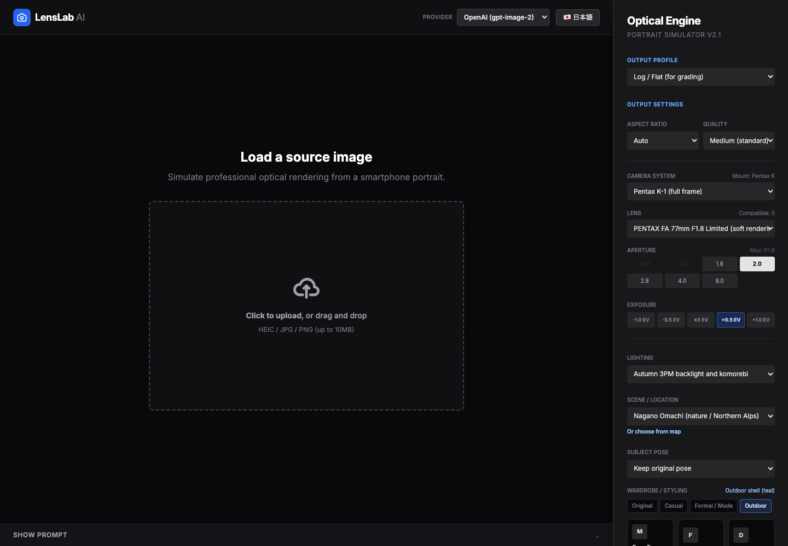
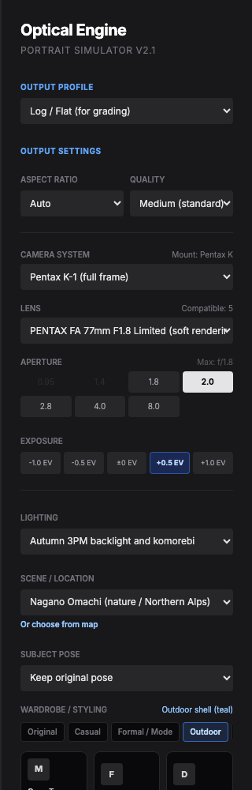
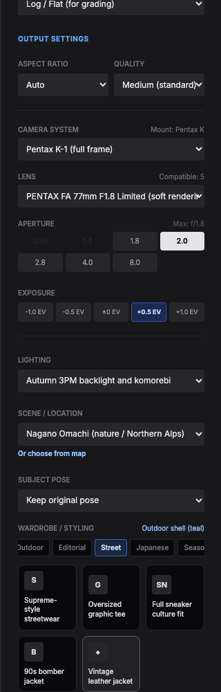
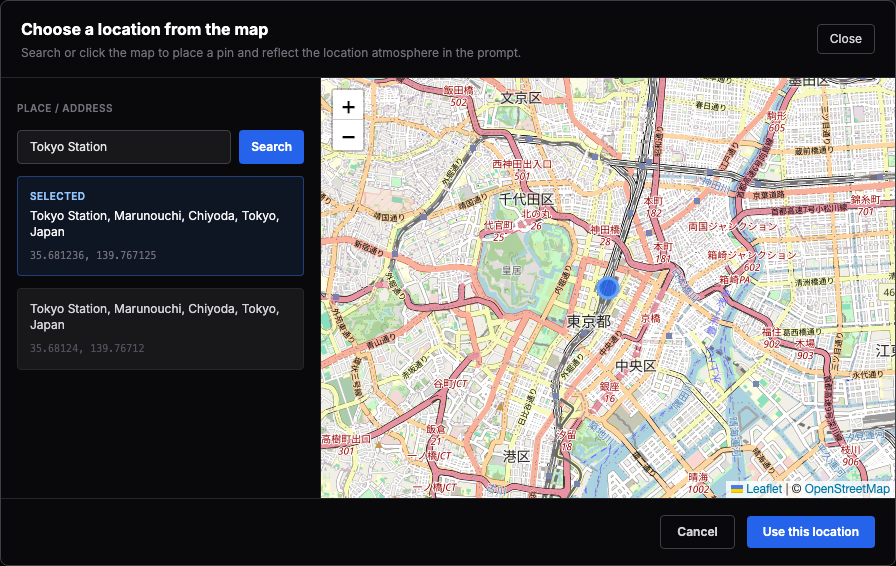

# LensLab AI


A professional optical simulation app that transforms portraits through camera/lens/lighting/scene/wardrobe controls using OpenAI gpt-image-2 or Gemini nano-banana.

> This project was originally scaffolded in Google AI Studio and now runs on a Vercel-proxied server architecture.

[日本語 README](./README.ja.md)

## Features

- Dual provider: OpenAI gpt-image-2 + Gemini nano-banana switchable
- Mount-accurate lens compatibility per camera body (Leica M / Sony E / Nikon Z / Canon RF / Pentax K / Fuji G / Hasselblad X / Phase One)
- 10+ camera bodies including medium format (Hasselblad X2D, Phase One IQ4, Fujifilm GFX100 II)
- 20+ legendary prime lenses (Noctilux, Summilux, Noct 58/0.95, Otus, Pentax Limited, etc.)
- 10 lighting presets + map-based location picker (Leaflet + OpenStreetMap)
- Theme-tabbed wardrobe with 30+ outfits
- Aspect ratio & quality controls for OpenAI
- Bilingual UI (JA / EN toggle)
- Prompt inspector with copy/debug

## Screenshots

| Landing | Controls |
| --- | --- |
|  |  |

| Wardrobe Tabs | Map Picker |
| --- | --- |
|  |  |

Screenshots can be regenerated with:

```bash
npm run screenshots
```

## One-Click Deploy

[](https://vercel.com/new/clone?repository-url=https://github.com/mocchalera/lenslab&env=OPENAI_API_KEY,GEMINI_API_KEY,NOMINATIM_CONTACT_EMAIL)

## Quick Start

```bash
git clone https://github.com/mocchalera/lenslab.git
cd lenslab
npm install
cp .env.example .env.local
```

Add your provider keys and geocoding contact email to `.env.local`:

```env
OPENAI_API_KEY=
GEMINI_API_KEY=
NOMINATIM_CONTACT_EMAIL=
```

`NOMINATIM_CONTACT_EMAIL` is required for map search. Set it to a real contact email in Vercel Project Settings; placeholder addresses such as `contact@example.com` are rejected before LensLab calls Nominatim.

Run locally with the Vercel runtime so `/api/*` functions are available:

```bash
npx vercel dev
```

For UI-only work, Vite can also run without provider keys:

```bash
npm run dev
```

## Environment Variables

| Variable | Required | Description |
| --- | --- | --- |
| `OPENAI_API_KEY` | Required for OpenAI | Server-side OpenAI API key used by `/api/image`. |
| `GEMINI_API_KEY` | Required for Gemini | Server-side Gemini API key used by `/api/image`. |
| `NOMINATIM_CONTACT_EMAIL` | Required for map search | Real contact email included in the Nominatim User-Agent for `/api/geocode`. |

Do not expose provider keys as `VITE_*` variables. Browser code calls only local API routes.

## Architecture

```text
Browser (React UI)
  -> POST /api/image
      -> Vercel Function
          -> OpenAI Images API (gpt-image-2)
          -> Gemini image API (nano-banana)

Browser (map picker)
  -> GET /api/geocode?q=...
      -> Vercel Function
          -> Nominatim / OpenStreetMap
```

`/api/image` normalizes provider responses into:

```json
{
  "dataUrl": "data:image/png;base64,...",
  "latencyMs": 1234,
  "usage": {},
  "debugPrompt": "..."
}
```

## Prompt Engineering

The UI is bilingual, but the final image prompt in `services/simulationPrompt.ts` intentionally stays in English. OpenAI and Gemini generally follow detailed photographic instructions more consistently when camera, lens, lighting, rendering, and wardrobe constraints are expressed in English.

## Cost and Safety Notes

API costs are your responsibility. No hosted demo is provided.

- Keep API keys server-side in Vercel environment variables.
- Large uploads are sent to `/api/image`; Vercel request size and function duration limits may apply.
- OpenAI and Gemini can interpret the same optical prompt differently.
- The map picker uses OpenStreetMap/Nominatim through `/api/geocode`; set a real `NOMINATIM_CONTACT_EMAIL` and respect Nominatim usage limits.

## Tech Stack

- Vite + React 19 + TypeScript
- Vercel Functions for server-side provider proxies
- OpenAI Images API (`gpt-image-2`)
- Google Gemini image generation
- Leaflet + React Leaflet + OpenStreetMap
- Playwright for screenshot capture

## Roadmap

- Expand the test framework described in `docs/testing/`
- Add more scene presets and regional lighting profiles
- Add provider-specific usage/cost previews
- Improve screenshot automation for more viewports
- Add richer prompt diffing and history export metadata

## Contributing

See [CONTRIBUTING.md](./CONTRIBUTING.md).

## License

MIT. See [LICENSE](./LICENSE).

## Credits

- OpenAI
- Google AI
- Leaflet
- OpenStreetMap contributors
- Nominatim
